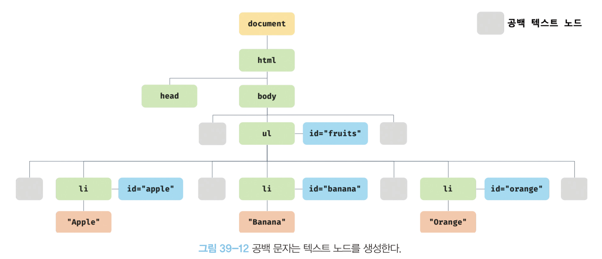
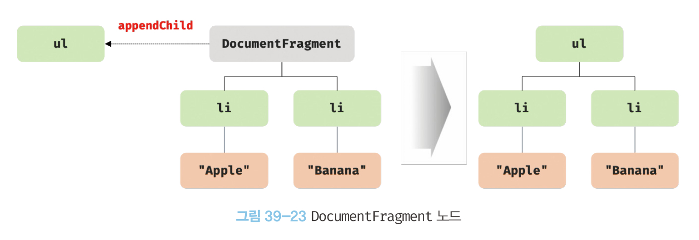

## 39장 DOM
- DOM은 HTML 문서의 계층적 구조와 정보를 표현하며 이를 제어할 수 있는 API, 즉 프로퍼티와 메서드를 제공하는 트리 자료구조이다.

### 39.1 노드
#### 39.1.1 HTML 요소와 노드 객체
- HTML 요소는 HTML 문서를 구성하는 개별적인 요소를 의미한다.
- HTML 요소는 렌더링 엔진에 의해 파싱되어 DOM을 구성하는 요소 노드 객체로 변환된다. HTML 요소의 어트리뷰트는 어트리뷰트 노드로, HTML 요소의 텍스트 콘텐츠는 텍스트 노드로 변환된다.

- HTML 요소 간에는 중첩 관계에 의한 부자 관계가 형성되고, 이를 반영하여 모든 노드 객체들을 트리 자료 구조로 구성한다. 트리 구조이기 때문에 DOM을 DOM 트리라고도 부른다.

#### 39.1.2 노드 객체의 타입
- 노드 객체는 총 12개의 노드 타입이 있다.
##### 문서 노드document node
- DOM 트리 최상위에 존재하는 루트 노드로서 document 객체를 가리킨다.
- document 객체는 브라우저가 렌더링한 HTML 문서 전체를 가리키는 객체로서, 전역 객체 window의 document 프로퍼티에 바인딩되어 있다. 따라서 문서 노드는 window.document 또는 document로 참조할 수 있다.
- 브라우저 환경의 모든 자바스크립트 코드는 script 태그에 의해 분리되어 있어도 하나의 전역 객체 window를 공유한다. HTML 문서당 document 객체는 유일하다.
- document 객체는 DOM 트리의 루트 노드로, DOM 트리의 노드들에 접근하기 위한 진입점 역할을 담당한다.
##### 요소 노드element node
- HTML 요소를 가리키는 객체이다.
- 요소 간의 중첩에 의해 부자 관계를 가지며, 부자 관계를 통해 정보를 구조화한다.
##### 어트리뷰트 노드attribute node
- HTML 요소의 어트리뷰트를 가리키는 객체이다.
- 어트리뷰트는 부모 노드가 없이 지정된 THML 요소 노드에만 연결되어 있다. 따라서 어트리뷰트를 참조하거나 변경하려면 먼저 요소 노드에 접근해야 한다.
##### 텍스트 노드text node
- HTML 요소의 텍스트를 가리키는 객체이다.
- 문서의 정보를 표현한다.
- 요소 노드의 자식 노드이며, 자식 노드를 가질 수 없는 리프노드이다. 따라서 텍스트 노드에 접근하려면 먼저 부모 노드인 요소 노드에 접근해야 한다.

#### 39.1.3 노드 객체의 상속 구조
- 노드 객체는 ECMAScript 사양에 정의된 표준 빌트인 객체가 아니라 브라우저 환경에서 제공하는 호스트 객체이다.
- 노드 객체도 자바스크립트 객체이므로 프로토타입에 의한 상속 구조를 갖는다.
- 모든 노드 객체는 Object, EventTarget, Node 인터페이스를 상속받는다.
- 문서 노드는 Document, HTMLDocument 인터페이스를, 어트리뷰트 노드는 Attr 인터페이스를, 텍스트 노드는 CharacterData 인터페이스를 각각 상속받는다.
- 요소 노드는 Element 인터페이스를 상속받는다.
- 상속 구조에 따라 프로토타입 체인에 있는 모든 프로토타입의 프로퍼티나 메서드를 상속받아 사용할 수 있다.
- 노드 객체의 상속 구조는 개발자도구의 Elements 패널 우측의 Properties 패널에서 확인할 수 있다.

### 39.2 요소 노드 취득
- HTML의 구조나 내용, 스타일을 동적으로 조작하려면 먼저 요소 노드를 취득해야 한다. 어트리뷰트 노드와 텍스트 노드를 조작할 때도 마찬가지이다.
#### 39.2.1 id를 이용한 요소 노드 취득
- Document.prototype.getElementById 메서드는 인수로 전달한 id 어트리뷰트 값을 갖는 하나의 요소 노드를 탐색하여 반환한다.
- id 값은 HTML 문서 내에서 유일한 값이어야 하며, 하나의 값만 가질 수 있다.
- 중복된 id 값을 갖는 HTML 요소가 여러 개 존재하는 경우에는 첫 번째 요소 노드만 반환한다.
- 인수로 전달된 id 값을 갖는 HTML 요소가 존재하는 않는 경우 null을 반환한다.
- HTML 요소에 id 어트리뷰트를 부여하면 id값과 동일한 이름의 전역 변수가 암묵적으로 선언되고 해당 노드 객체가 할당된다.
```html
<!DOCTYPE html>
<html>
  <body>
    <div id="foo"></div>
    <script>
      // id 값과 동일한 이름의 전역 변수가 암묵적으로 선언되고 해당 노드 객체가 할당된다.
      console.log(foo === document.getElementById('foo')); // true

      // 암묵적 전역으로 생성된 전역 프로퍼티는 삭제되지만 전역 변수는 삭제되지 않는다.
      delete foo;
      console.log(foo); // <div id="foo"></div>
    </script>
  </body>
</html>
```
- id 값과 동일한 이름의 전역 변수가 이미 선언되어 있으면 이 전역 변수에 노드 객체가 재할당되지 않는다.
```html
<!DOCTYPE html>
<html>
  <body>
    <div id="foo"></div>
    <script>
      let foo = 1;

      // id 값과 동일한 이름의 전역 변수가 이미 선언되어 있으면 노드 객체가 재할당되지 않는다.
      console.log(foo); // 1
    </script>
  </body>
</html>
```
#### 39.2.2 태그 이름을 이용한 요소 노드 취득
- Document.prototype/Element.prototype.getElementsByTagName 메서드는 인수로 전달한 태그 이름과 일치하는 모든 요소 노드들을 탐색하여 DOM 컬렉션 객체인 HTMLCollection 객체를 반환한다.
- HTMLCollection 객체는 유사 배열 객체이면서 이터러블이다.
- HTML 문서의 모든 요소 노드를 취득하려면 getElementsByTagName 메서드의 인수로 '*'을 전달한다.
- Document.prototype.getElementsByTagName 메서드는 모든 요소 노드를 탐색하여 반환하고, Element.prototype.getElementsByTagName 메서드는 특정 요소 노드의 자손 노드 중에서 탐색한다.
- 인수로 전달한 태그 이름을 갖는 요소가 존재하지 않을 경우 빈 HTMLCollection 객체를 반환한다.
#### 39.2.3 class 이름을 이용한 요소 노드 취득
- Document.prototype/Element.prototype.getElementsByClassName 메서드는 인수로 전달한 class 이름과 일치하는 모든 요소 노드들을 탐색하여 DOM 컬렉션 객체인 HTMLCollection 객체를 반환한다.
- Document.prototype.getElementsByClassName 메서드는 모든 요소 노드를 탐색하여 반환하고, Element.prototype.getElementsByClassName 메서드는 특정 요소 노드의 자손 노드 중에서 탐색한다.
- 인수로 전달한 class 이름을 갖는 요소가 존재하지 않을 경우 빈 HTMLCollection 객체를 반환한다.
#### 39.2.4 CSS 선택자를 이용한 요소 노드 취득
- Document.prototype/Element.prototype.querySelector 메서드는 인수로 전달한 CSS 선택자를 만족시키는 하나의 요소 노드를 탐색하여 반환한다.
- Document.prototype.querySelector 메서드는 모든 요소 노드를 탐색하여 반환하고, Element.prototype.querySelector 메서드는 특정 요소 노드의 자손 노드 중에서 탐색한다.
- 인수로 전달한 CSS 선택자를 만족시키는 요소 노드가 여러 개인 경우 첫 번째 요소 노드만 반환한다.
- 인수로 전달한 CSS 선택자를 만족시키는 요소가 존재하지 않을 경우 null을 반환한다.
- Document.prototype/Element.prototype.querySelectorAll 메서드는 인수로 전달한 CSS 선택자를 만족시키는 모든 요소 노드들을 탐색하여 DOM 컬렉션 객체인 NodeList 객체를 반환한다.
- NodeList 객체는 유사 배열 객체이면서 이터러블이다.
- 인수로 전달한 CSS 선택자를 만족시키는 요소가 존재하지 않을 경우 빈 NodeList 객체를 반환한다.
- querySelector와 querySelectorAll 메서드는 인수로 전달한 CSS 선택자가 문법에 맞지 않는 경우 DOMException 에러가 발생한다.
- HTML 문서의 모든 요소 노드를 취득하려면 querySelectorAll 메서드의 인수로 '*'을 전달한다.
- Document.prototype.querySelector 메서드는 모든 요소 노드를 탐색하여 반환하고, Element.prototype.querySelector 메서드는 특정 요소 노드의 자손 노드 중에서 탐색한다.
- querySelector와 querySelectorAll 메서드는 getElementById, getElementsBy*** 메서드보다 다소 느린 것으로 알려져 있다.
- 하지만 CSS 선택자 문법을 사용하여 좀 더 구체적이고 선택적으로 요소 노드를 취득할 수 있다는 장점이 있다.

#### 39.2.5 특정 요소 노드를 취득할 수 있는지 확인
- Element.prototype.matches 메서드는 인수로 전달한 CSS 선택자를 통해 특정 요소 노드를 취득할 수 있는지 확인하여 그 결과를 boolean 값으로 반환한다.

#### 39.2.6 HTMLCollection과 NodeList
- HTMLCollection과 NodeList는 모두 배열 형태로 요소 노드를 저장하는 DOM 컬렉션 객체이다.
- 모두 유사 배열 객체이면서 이터러블이기 때문에 for...of 문으로 순회할 수 있고, 스프레드 문법을 사용할 수 있다.
- HTMLCollection은 항상 요소 노드 객체의 상태 변화를 실시간으로 반영하는 살아있는live 객체이다.
- NodeList는 대부분 과거의 정적 상태를 유지하는 non-live 객체로 동작하지만 경우에 따라 live 객체로 동작할 수 있다.
##### HTMLCollection
- HTMLCollection은 실시간으로 노드 객체의 상태 변경을 반영하여 요소를 제거할 수 있기 때문에 HTMLCollection 객체를 for 문으로 순회하면서 노드 객체의 상태를 변경해야 할 때 주의해야 한다.
```html
<!DOCTYPE html>
<head>
  <style>
    .red { color: red; }
    .blue { color: blue; }
  </style>
</head>
<html>
  <body>
    <ul id="fruits">
      <li class="red">Apple</li>
      <li class="red">Banana</li>
      <li class="red">Orange</li>
    </ul>
    <script>
      // class 값이 'red'인 요소 노드를 모두 탐색하여 HTMLCollection 객체에 담아 반환한다.
      const $elems = document.getElementsByClassName('red');
      // 이 시점에 HTMLCollection 객체에는 3개의 요소 노드가 담겨 있다.
      console.log($elems); // HTMLCollection(3) [li.red, li.red, li.red]

      // HTMLCollection 객체의 모든 요소의 class 값을 'blue'로 변경한다.
      for (let i = 0; i < $elems.length; i++) {
        $elems[i].className = 'blue';
      }

      // HTMLCollection 객체의 요소가 3개에서 1개로 변경되었다.
      console.log($elems); // HTMLCollection(1) [li.red]
    </script>
  </body>
</html>
```
- 위 코드는 for문을 순회할 때마다 $elems가 변경되기 때문에 두 번째 li 요소의 class 값은 변경되지 않는다.
- 이 문제는 for문은 역방향으로 순회하거나 while을 사용하여 회피할 수 있다.
```html
// for 문을 역방향으로 순회
for (let i = $elems.length - 1; i >= 0; i--) {
  $elems[i].className = 'blue';
}

// while 문으로 HTMLCollection에 요소가 남아 있지 않을 때까지 무한 반복
let i = 0;
while ($elems.length > i) {
  $elems[i].className = 'blue';
}
```
- 부작용을 발생시키는 원인인 HTMLCollection 객체를 사용하지 않고 배열로 변환하여 사용할 수 있다.
```html
// 유사 배열 객체이면서 이터러블인 HTMLCollection을 배열로 변환하여 순회
[...$elems].forEach(elem => elem.className = 'blue');
```
##### NodeList
- HTMLCollection 객체의 부작용을 해결하기 위해 querySelectorAll 메서드를 사용하여 반환되는 NodeList 객체를 사용할 수 있다.
- NodeList 객체는 실시간으로 노드 객체의 상태 변경을 반영하지 않는 non-live 객체이다.
```html
// querySelectorAll은 DOM 컬렉션 객체인 NodeList를 반환한다.
const $elems = document.querySelectorAll('.red');

// NodeList 객체는 NodeList.prototype.forEach 메서드를 상속받아 사용할 수 있다.
$elems.forEach(elem => elem.className = 'blue');
```
- childNodes 프로퍼티가 반환하는 NodeList 객체는 HTMLCollection 객체와 마찬가지로 실시간으로 노드 객체의 상태 변경을 반영하는 live 객체로 동작하므로 주의가 필요하다.
- 노드 객체의 상태 변화와 상관없이 안전하게 DOM 컬렉션을 사용하려면 HTMLCollection이나 NodeList 객체를 배열로 변환하여 사용하는 것을 권장한다.

#### 39.3 노드 탐색
- 취득한 요소 노드를 기점으로 DOM 트리의 노드를 탐색할 수 있다.
- Node.prototype은 parentNode, previousSibling, firstChild, childNodes 프로퍼티를, Element.prototype은 previousElementSibling, nextElementSibling, children 프로퍼티를 제공한다.
- 노드 탐색 프로퍼티는 setter 없이 getter만 존재하는 읽기 전용 접근자 프로퍼티다. 값을 할당하면 아무런 에러 없이 무시된다.
##### 39.3.1 공백 텍스트 노드
- HTML 요소 사이의 스페이스, 탭, 줄바꿈(개행) 등의 공백 문자는 텍스트 노드를 생성한다. 이를 공백 텍스트 노드라 한다.
- 노드를 탐색할 때는 공백 문자가 생성한 공백 텍스트 노드에 주의해야 한다.
```html
<!DOCTYPE html>
<html>
  <body>
    <ul id="fruits">
      <li class="apple">Apple</li>
      <li class="banana">Banana</li>
      <li class="orange">Orange</li>
    </ul>
  </body>
</html>
```

##### 39.3.2 자식 노드 탐색
- Node.prototype.childNodes 프로퍼티는 자식 노드 목록을 표현하는 NodeList 객체를 반환한다. 텍스트 노드도 포함되어 있을 수 있다.
- Element.prototype.children 프로퍼티는 자식 노드 중에서 요소 노드만 탐색하여 HTMLCollection 객체를 반환한다. 텍스트 노드는 포함되어 있지 않다.
- Node.prototype.firstChild 프로퍼티는 첫 번째 자식 노드를 반환한다. 반환한 노드는 텍스트 노드이거나 요소 노드다.
- Node.prototype.lastChild 프로퍼티는 마지막 자식 노드를 반환한다. 반환한 노드는 텍스트 노드이거나 요소 노드다.
- Element.prototype.firstElementChild 프로퍼티는 첫 번째 자식 노드를 반환한다. 요소 노드만 반환한다.
- Element.prototype.lastElementChild 프로퍼티는 마지막 자식 노드를 반환한다. 요소 노드만 반환한다.
##### 39.3.3 자식 노드 존재 확인
- 자식 노드가 존재하는지 확인하려면 Node.prototype.hasChildNodes 메서드를 사용한다.
- 인수로 전달한 노드에 자식 노드가 존재하는 경우 true, 존재하지 않는 경우 false를 반환한다.
- 텍스트 노드를 포함하여 자식 노드의 존재를 확인한다.
- 텍스트 노드가 아닌 요소 노드의 존재를 확인하려면 children.length 또는 Element 인터페이스의 childElementCount 프로퍼티를 사용한다.
##### 39.3.4 요소 노드의 텍스트 노드 탐색
- 텍스트 노드는 요소 노드의 자식 노드이기 때문에 firstChild 프로퍼티로 접근할 수 있다.
##### 39.3.5 부모 노드 탐색
- Node.prototype.parentNode 프로퍼티는 부모 노드를 탐색하여 반환한다.
- 텍스트노드는 리프 노드이므로 부모 노드가 텍스트 노드인 경우는 없다.
##### 39.3.6 형제 노드 탐색
- 어트리뷰트 노드는 요소 노드와 연결되어 있지만 형제 노드가 아니기 때문에 반환되지 않는다.
- Node.prototype.previousSibling 프로퍼티는 부모 노드의 자식 노드 중에서 자신의 이전 형제 노드를 탐색하여 반환한다. 텍스트 노드 또는 요소노드일 수 있다.
- Node.prototype.nextSibling 프로퍼티는 부모 노드의 자식 노드 중에서 자신의 다음 형제 노드를 탐색하여 반환한다. 텍스트 노드 또는 요소노드일 수 있다.
- Element.prototype.previousElementSibling 프로퍼티는 부모 노드의 자식 노드 중에서 자신의 이전 형제 노드를 탐색하여 반환한다. 요소 노드만 반환한다.
- Element.prototype.nextElementSibling 프로퍼티는 부모 노드의 자식 노드 중에서 자신의 다음 형제 노드를 탐색하여 반환한다. 요소 노드만 반환한다.
### 39.4 노드 정보 취득
- Node.prototype.nodeType 프로퍼티는 노드 객체의 종류, 즉 노드 타입을 나타내는 상수를 반환한다.
- Node.prototype.nodeName 프로퍼티는 노드 객체의 이름을 문자열로 반환한다.
### 39.5 요소 노드의 텍스트 조작
#### 39.5.1 nodeValue
- Node.prototype.nodeValue 프로퍼티는 노드 객체의 값을 반환한다.
- 노드 객체의 값이란 텍스트 노드의 텍스트로, 텍스트 노드가 아닌 노드의 nodeValue 프로퍼티를 참조하면 null을 반환한다.
- setter와 getter 모두 존재하는 접근자 프로퍼티다.
```html
<!DOCTYPE html>
<html>
  <body>
    <div id="foo">Hello</div>
  </body>
  <script>
    // 1. #foo 요소 노드의 자식 노드인 텍스트 노드를 취득한다.
    const $textNode = document.getElementById('foo').firstChild;

    // 2. nodeValue 프로퍼티를 사용하여 텍스트 노드의 값을 변경한다.
    $textNode.nodeValue = 'World';

    console.log($textNode.nodeValue); // World
  </script>
</html>
```
#### 39.5.2 textContent
- Element.prototype.textContent 프로퍼티는 요소 노드의 텍스트와 모든 자손 노드의 텍스트를 모두 탐색하여 하나의 문자열로 반환한다.
- setter와 getter가 모두 존재하는 접근자 프로퍼티다.
```html
<!DOCTYPE html>
<html>
  <body>
    <div id="foo">Hello <span>world!</span></div>
  </body>
  <script>
    // #foo 요소 노드의 텍스트를 모두 취득한다. 이때 HTML 마크업은 무시된다.
    console.log(document.getElementById('foo').textContent); // Hello world!
  </script>
</html>
```
- 요소 노드의 콘텐츠 영역에 자식 요소 노드가 없고 텍스트만 존재한다면 firstChild.nodeValue와 textContent 프로퍼티는 같은 결과를 반환한다.
```html
<!DOCTYPE html>
<html>
  <body>
    <!-- 요소 노드의 콘텐츠 영역에 다른 요소 노드가 없고 텍스트만 존재 -->
    <div id="foo">Hello</div>
  </body>
  <script>
    const $foo = document.getElementById('foo');

    // 요소 노드의 콘텐츠 영역에 자식 요소 노드가 없고 텍스트만 존재한다면
    // firstChild.nodeValue와 textContent는 같은 결과를 반환한다.
    console.log($foo.textContent === $foo.firstChild.nodeValue); // true
  </script>
</html>
```
- 요소 노드의 textContent 프로퍼티에 문자열을 할당하면 요소 노드의 모든 자식 노드가 제거되고 할당한 문자열이 텍스트로 추가된다. HTML 마크업은 파싱되지 않고 문자열 그대로 인식되어 텍스트로 취급된다.
```html
<!DOCTYPE html>
<html>
  <body>
    <div id="foo">Hello <span>world!</span></div>
  </body>
  <script>
    // #foo 요소 노드의 모든 자식 노드가 제거되고 할당한 문자열이 텍스트로 추가된다.
    // 이때 HTML 마크업이 파싱되지 않는다.
    document.getElementById('foo').textContent = 'Hi <span>there!</span>';
  </script>
</html>
```
- 유사한 프로퍼티로 innerText 프로퍼티가 있는데 다음의 이유로 권장하지 않는다.
    - CSS의 영향을 받는다. CSS에 의해 비표시(visibility: hidden)된 요소의 텍스트는 반환하지 않는다.
    - CSS를 고려해야 하므로 textContent 프로퍼티보다 느리다.

### 39.6 DOM 조작
- DOM 조작은 새로운 노드를 생성하여 DOM에 추가하거나 기존 노드를 삭제 또는 교체하는 것을 말한다.
- 리플로우와 리페인트가 발생할 수 있기 때문에 성능 최적화를 위해 주의해서 다루어야 한다.
#### 39.6.1 innerHTML
- Element.prototype.innerHTML 프로퍼티는 요소 노드의 HTML 마크업을 취득하거나 변경한다.
- setter와 getter 모두 존재하는 접근자 프로퍼티다.
- 요소 노드의 innerHTML 프로퍼티를 참조하면 요소 노드의 콘텐츠 영역(시작 태그와 종료 태그 사이)에 포함된 모든 HTML 마크업을 문자열로 반환한다.
```html
<!DOCTYPE html>
<html>
  <body>
    <div id="foo">Hello <span>world!</span></div>
  </body>
  <script>
    // #foo 요소의 콘텐츠 영역 내의 HTML 마크업을 문자열로 취득한다.
    console.log(document.getElementById('foo').innerHTML);
    // "Hello <span>world!</span>"
  </script>
</html>
```
- textContent 프로퍼티는 HTML 마크업을 무시하고 텍스틑만 반환하지만 innerHTML 프로퍼티는 HTML 마크업이 포함된 문자열을 그대로 반환한다.
- 요소 노드의 innerText 프로퍼티에 문자열을 할당하면 요소 노드의 모든 자식 노드가 제거되고 HTML 마크업이 파싱되어 요소 노드의 자식노드로 DOM에 반영된다.
- 사용자로부터 입력받은 데이터를 그대로 innerHTML 프로퍼티에 할당하는 것은 크로스 사이트 스크립팅 공격(XSS, Cross Site Scripting Attacks)에 취약하므로 위험하다. HTML 마크업 내에 자바스크립트 악성 코드가 포함되어 있다면 파싱 과정에서 그대로 실행될 가능성이 있기 때문이다.
- HTML5는 innerHTML 프로퍼티로 삽입된 script 요소 내의 자바스크립트 코드를 실행하지 않는다. 하지만 script 요소 없이도 크로스 사이트 스크립팅 공격은 가능하다.
```html
<!DOCTYPE html>
<html>
  <body>
    <div id="foo">Hello</div>
  </body>
  <script>
    // 에러 이벤트를 강제로 발생시켜서 자바스크립트 코드가 실행되도록 한다.
    document.getElementById('foo').innerHTML
      = ``;
  </script>
</html>
```

> HTML 새니티제이션sanitization
> 사용자로부터 입력받은 데이터에 의해 발생할 수 있는 XSS를 예방하기 위해 잠재적 위험을 제거하는 기능을 말한다.
> 새니티제이션 함수를 직접 구현할 수도 있지만 DOMPurify와 같은 라이브러리를 사용하는 것을 권장한다.
- innerHTML 프로퍼티에 HTML 마크업 문자열을 할당하는 경우 요소 노드의 모든 자식 노드를 제거하고 할당한 HTML 마크업 문자열을 파싱하여 DOM을 변경하여 비효율적이다.
```html
<!DOCTYPE html>
<html>
  <body>
    <ul id="fruits">
      <li class="apple">Apple</li>
    </ul>
  </body>
  <script>
    const $fruits = document.getElementById('fruits');

    // 노드 추가
    // 기존의 모든 자식 노드를 제거하고 새로 생성하여 자식노드로 추가한다.
    $fruits.innerHTML += '<li class="banana">Banana</li>';
  </script>
</html>
```
- 새로운 요소를 삽입할 때 삽입될 위치를 지정할 수 없어, 기존 요소를 제거하지 않으면서 위치를 지정해 새로운 요소를 삽입해야할 때는 사용하지 않는 것이 좋다.
#### 39.6.2 insertAdjacentHTML 메서드
- Element.prototype.insertAdjacentHTML 메서드는 기존 요소를 제거하지 않으면서 위치를 지정해 새로운 요소를 삽입한다.
```html
<!DOCTYPE html>
<html>
  <body>
    <!-- beforebegin -->
    <div id="foo">
      <!-- afterbegin -->
      text
      <!-- beforeend -->
    </div>
    <!-- afterend -->
  </body>
  <script>
    const $foo = document.getElementById('foo');

    $foo.insertAdjacentHTML('beforebegin', '<p>beforebegin</p>');
    $foo.insertAdjacentHTML('afterbegin', '<p>afterbegin</p>');
    $foo.insertAdjacentHTML('beforeend', '<p>beforeend</p>');
    $foo.insertAdjacentHTML('afterend', '<p>afterend</p>');
  </script>
</html>
```
- 기존 요소에 영향을 주지 않고 새롭게 삽입될 요소만을 파싱하여 자식 요소로 추가하므로 innerHTML 프로퍼티보다 효율적이고 빠르다.
- XSS 공격에 취약하다는 점은 동일하다.
#### 39.6.3 노드 생성과 추가
```html
<!DOCTYPE html>
<html>
  <body>
    <ul id="fruits">
      <li>Apple</li>
    </ul>
  </body>
  <script>
    const $fruits = document.getElementById('fruits');

    // 1. 요소 노드 생성
    const $li = document.createElement('li');

    // 2. 텍스트 노드 생성
    const textNode = document.createTextNode('Banana');

    // 3. 텍스트 노드를 $li 요소 노드의 자식 노드로 추가
    $li.appendChild(textNode);

    // 4. $li 요소 노드를 #fruits 요소 노드의 마지막 자식 노드로 추가
    $fruits.appendChild($li);
  </script>
</html>
```
##### 요소 노드 생성
- Document.prototype.createElement 메서드는 요소 노드를 생성하여 반환한다. 매개변수로 태그 이름을 나타내는 문자열을 인수로 전달한다.
- 생성된 요소 노드는 기존 노드에 추가되지 않는다. 따라서 생성된 요소 노드를 DOM에 추가하려면 별도로 appendChild, insertBefore 메서드 등을 사용해야 한다.
##### 텍스트 노드 생성
- Document.prototype.createTextNode 메서드는 텍스트 노드를 생성하여 반환한다. 매개변수로 텍스트 노드의 값으로 사용할 문자열을 인수로 전달한다.
- 생성된 텍스트 노드는 기존 노드에 추가되지 않는다. 따라서 생성된 텍스트 노드를 DOM에 추가하려면 별도로 appendChild, insertBefore 메서드 등을 사용해야 한다.
##### 요소 노드를 DOM에 추가
- Node.prototype.appendChild 메서드는 인수로 전달한 노드를 appendChild 메서드를 호출한 노드의 마지막 자식 노드로 추가한다.
- appendChild 메서드의 인수로 createTextNode 메서드로 생성한 텍스트 노드를 전달하면 appendChild 메서드를 호출한 노드의 마지막 자식 노드로 텍스트 노드가 추가된다.
- 요소 노드에 자식 노드가 하나도 없는 경우에는 텍스트 노드를 생성하여 요소 노드의 자식 노드로 텍스트 노드를 추가하는 것보다 textContent 프로퍼티를 사용하는 것이 더욱 간편하다.
- 요소 노드를 생성하여 DOM에 추가 하면 리플로우와 리페인트가 실행된다.
#### 39.6.4 복수의 노드 생성과 추가
```html
<!DOCTYPE html>
<html>
  <body>
    <ul id="fruits"></ul>
  </body>
  <script>
    const $fruits = document.getElementById('fruits');

    ['Apple', 'Banana', 'Orange'].forEach(text => {
      // 1. 요소 노드 생성
      const $li = document.createElement('li');

      // 2. 텍스트 노드 생성
      const textNode = document.createTextNode(text);

      // 3. 텍스트 노드를 $li 요소 노드의 자식 노드로 추가
      $li.appendChild(textNode);

      // 4. $li 요소 노드를 #fruits 요소 노드의 마지막 자식 노드로 추가
      $fruits.appendChild($li);
    });
  </script>
</html>
```
- 위 예제에서는 3개의 요소 노드를 생성하여 DOM에 3번 추가하므로 DOM이 3번 변경되고, 리플로우와 리페인트도 3번 실행된다.
##### container
- DOM을 여러 번 변경하지 않기 위해 컨테이너 요소를 사용해서 DOM이 한 번만 변경되게 할 수 있다. 그러나 불필요한 컨테이너 요소가 추가된다.
```html
<!DOCTYPE html>
<html>
  <body>
    <ul id="fruits"></ul>
  </body>
  <script>
    const $fruits = document.getElementById('fruits');

    // 컨테이너 요소 노드 생성
    const $container = document.createElement('div');

    ['Apple', 'Banana', 'Orange'].forEach(text => {
      // 1. 요소 노드 생성
      const $li = document.createElement('li');

      // 2. 텍스트 노드 생성
      const textNode = document.createTextNode(text);

      // 3. 텍스트 노드를 $li 요소 노드의 자식 노드로 추가
      $li.appendChild(textNode);

      // 4. $li 요소 노드를 컨테이너 요소의 마지막 자식 노드로 추가
      $container.appendChild($li);
    });

    // 5. 컨테이너 요소 노드를 #fruits 요소 노드의 마지막 자식 노드로 추가
    $fruits.appendChild($container);
  </script>
</html>
```
##### DocumentFragment
- DocumentFragment 노드는 문서, 요소, 어트리뷰트, 텍스트 노드와 같은 노드 객체의 일종으로 부모 노드가 없어서 기존 DOM과는 별도로 존재한다. DocumentFragment 노드를 사용하여 서브 DOM을 구성하여 기존 DOM에 추가하기 위한 용도로 사용할 수 있다.
- DocumentFragment 노드는 기존 DOM과 별도로 존재하므로 기존 DOM에는 어떤 변경도 발생하지 않는다.
- DocumentFragment 노드를 DOM에 추가하면 자신은 제거되고 자신의 자식 노드만 DOM에 추가된다.
- DOM 변경은 한 번만 발생한다.
```html
<!DOCTYPE html>
<html>
  <body>
    <ul id="fruits"></ul>
  </body>
  <script>
    const $fruits = document.getElementById('fruits');

    // DocumentFragment 노드 생성
    const $fragment = document.createDocumentFragment();

    ['Apple', 'Banana', 'Orange'].forEach(text => {
      // 1. 요소 노드 생성
      const $li = document.createElement('li');

      // 2. 텍스트 노드 생성
      const textNode = document.createTextNode(text);

      // 3. 텍스트 노드를 $li 요소 노드의 자식 노드로 추가
      $li.appendChild(textNode);

      // 4. $li 요소 노드를 DocumentFragment 노드의 마지막 자식 노드로 추가
      $fragment.appendChild($li);
    });

    // 5. DocumentFragment 노드를 #fruits 요소 노드의 마지막 자식 노드로 추가
    $fruits.appendChild($fragment);
  </script>
</html>
```

#### 39.6.5 노드 삽입
##### 마지막 노드로 추가
- Node.prototype.appendChild 메서드는 인수로 전달한 노드를 appendChild 메서드를 호출한 노드의 마지막 자식 노드로 추가한다.
##### 지정한 위치에 노드 삽입
- Node.prototype.insertBefore 메서드는 첫 번째 인수로 전달한 노드를 두 번째 인수로 전달한 노드 앞에 삽입한다. 
    두 번째 인수로 전달받은 노드는 반드시 insertBefore 메서드를 호출한 노드의 자식 노드이어야 한다. 그렇지 않으면 DOMException 에러가 발생한다.
    - 두 번째 인수로 전달한 노드가 null이면 첫 번째 인수로 전달한 노드를 마지막 자식 노드로 추가한다.
#### 39.6.6 노드 이동
- DOM에 이미 존재하는 노드를 appendChild 또는 insertBefore 메서드를 사용하여 DOM에 다시 추가하면 현재 위치에 노드를 제거하고 새로운 위치에 노드를 추가한다.
```html
<!DOCTYPE html>
<html>
  <body>
    <ul id="fruits">
      <li>Apple</li>
      <li>Banana</li>
      <li>Orange</li>
    </ul>
  </body>
  <script>
    const $fruits = document.getElementById('fruits');

    // 이미 존재하는 요소 노드를 취득
    const [$apple, $banana, ] = $fruits.children;

    // 이미 존재하는 $apple 요소 노드를 #fruits 요소 노드의 마지막 노드로 이동
    $fruits.appendChild($apple); // Banana - Orange - Apple

    // 이미 존재하는 $banana 요소 노드를 #fruits 요소의 마지막 자식 노드 앞으로 이동
    $fruits.insertBefore($banana, $fruits.lastElementChild);
    // Orange - Banana - Apple
  </script>
</html>
```
#### 39.6.7 노드 복사
- Node.prototype.cloneNode 메서드는 노드의 사본을 생성하여 반환한다. 
- 매개변수로 전달한 인수가 true이면 노드를 깊은 복사하여 모든 자손 노드가 포함된 사본을 생성하고, false이거나 생략하면 노드를 얕은 복사하여 노드 자신만의 사본을 생성한다.
- 얕은 복사로 생성된 요소 노드는 자손 노드를 복사하지 않으므로 텍스트 노드도 없다.
#### 39.6.8 노드 교체
- Node.prototype.replaceChild(newChild, oldChild) 메서드는 첫 번째 인수로 전달한 노드로 두 번째 인수로 전달한 노드를 교체한다.
- oldChild 매개변수에 인수로 전달한 노드는 replaceChild 메서드를 호출한 노드의 자식 노드이어야 한다. 
- oldChild 노드는 DOM에서 제거된다.
#### 39.6.9 노드 삭제
- Node.prototype.removeChild 메서드는 인수로 전달한 노드를 DOM에서 삭제한다.
- 인수로 전달한 노드는 removeChild 메서드를 호출한 노드의 자식 노드이어야 한다.

### 39.7 어트리뷰트
#### 39.7.1 어트리뷰트 노드와 attributes 프로퍼티
- HTML 요소는 여러 개의 어트리뷰트를 가질 수 있다.
- 어트리뷰트는 HTML 요소의 동작을 제어하기 위한 추가적인 정보를 제공한다.
- HTML 요소의 시작 태그에 어트리뷰트 이름="어트리뷰트 값" 형식으로 정의한다.
```html
<input id="user" type="text" value="ungmo2">
```
- 글로벌 어트리뷰트(id, class, style, title, lang, dir, hidden 등)와 이벤트 핸들러 어트리뷰트(onclick, onchange, onfocus, onblur 등)는 모든 HTML 요소가 공통적으로 사용할 수 있다.
- 특정 HTML 요소에만 한정적으로 사용 가능한 어트리뷰트도 있다. type, value, checked 어트리뷰트는 input 요소에서만 사용할 수 있다.
- HTML 문서가 파싱될 때 HTML 요소의 어트리뷰트는 어트리뷰트 노드로 변환되어 요소 노드와 연결된다. HTML 어트리뷰트당 하나의 어트리뷰트 노드가 생성된다.
- 모든 어트리뷰트 노드의 참조는 유사배열객체이자 이터러블인 NamedNodeMap 객체에 담겨서 요소 노드의 attributes 프로퍼티에 저장된다. 따라서 요소 노드의 모든 어트리뷰트 노드는 요소노드의 Element.prototype.attributes 프로퍼티로 취득할 수 있다.
- attributes 프로퍼티는 getter만 존재하는 읽기 전용 접근자 프로퍼티이며, 요소 노드의 모든 어트리뷰트 노드의 참조가 담긴 NamedNodeMap 객체를 반환한다.
#### 39.7.2 HTML 어트리뷰트 조작
- Element.prototype.getAttribute/setAttribute 메서드를 사용하면 attributes 프로퍼티를 통하지 않고 요소 노드의 메서드를 통해 직접 HTML 어트리뷰트 값을 취득하거나 변경할 수 있다.
```html
<!DOCTYPE html>
<html>
<body>
  <input id="user" type="text" value="ungmo2">
  <script>
    const $input = document.getElementById('user');

    // value 어트리뷰트 값을 취득
    const inputValue = $input.getAttribute('value');
    console.log(inputValue); // ungmo2

    // value 어트리뷰트 값을 변경
    $input.setAttribute('value', 'foo');
    console.log($input.getAttribute('value')); // foo
  </script>
</body>
</html>
```
- 특정 HTML 어트리뷰트가 존재하는지 확인하려면 Element.prototype.hasAttribute 메서드를 사용한다.
- 특정 HTML 어트리뷰트를 삭제하려면 Element.prototype.removeAttribute 메서드를 사용한다.
#### 39.7.3 HTML 어트리뷰트 vs DOM 프로퍼티
- 요소 노드 객체에는 HTML 어트리뷰트에 대응하는 프로퍼티(DOM 프로퍼티)가 존재한다. DOM 프로퍼티들은 HTML 어트리뷰트 값을 초기값으로 가지고 있다.
- DOM 프로퍼티는 setter와 getter가 모두 존재하는 접근자 프로퍼티이다.
```html
<!DOCTYPE html>
<html>
<body>
  <input id="user" type="text" value="ungmo2">
  <script>
    const $input = document.getElementById('user');

    // 요소 노드의 value 프로퍼티 값을 변경
    $input.value = 'foo';

    // 요소 노드의 value 프로퍼티 값을 참조
    console.log($input.value); // foo
  </script>
</body>
</html>
```
##### 어트리뷰트 노드
- HTML 요소의 초기 상태는 어트리뷰트 노드에서 관리한다.
- 사용자 입력에 의해 상태가 변경되어도 변하지 않고 초기 상태를 그대로 유지한다.
- 어트리뷰트 노드가 관리하는 초기 상태 값을 취득하거나 변경하려면 getAttribute/setAttribute 메서드를 사용한다.
##### DOM 프로퍼티
- 사용자가 입력한 최신 상태는 HTML 어트리뷰트에 대응하는 요소 노드의 DOM 프로퍼티가 관리한다.
- 사용자 입력에 의한 상태 변화와 관계있는 DOM 프로퍼티는 사용자의 입력에 의한 상태 변화에 반응하여 언제나 최신 상태를 유지한다.
- 사용자 입력에 의한 상태 변화와 관계없는 id 어트리뷰트와 id 프로퍼티는 사용자 입력과 관계없이 항상 동일한 값을 유지한다. 하나가 변하면 다른 값도 동일하게 연동되어 변경된다.
##### HTML 어트리뷰트와 DOM 프로퍼티의 대응관계
- 대부분의 HTML 어트리뷰트는 HTML 어트리뷰트 이름과 동일한 DOM 프로퍼티와 1:1로 대응하지만 언제나 1:1로 대응하는 것은 아니며, HTML 어트리뷰트 이름과 DOM 프로퍼티 키가 반드시 일치하는 것도 아니다.
> - id 어트리뷰트와 id 프로퍼티는 1:1 대응하며, 동일한 값으로 연동한다.
> - input 요소의 value 어트리뷰트는 value 프로퍼티와 1:1 대응한다. 하지만 value 어트리뷰트는 초기 상태를, value 프로퍼티는 최신 상태를 갖는다.
> - class 어트리뷰트는 className, classList 프로퍼티와 대응한다.
> - for 어트리뷰트는 htmlFor 프로퍼티와 1:1 대응한다.
> - td 요소의 colspan 어트리뷰트는 대응하는 프로퍼티가 존재하지 않는다.
> - textContent 프로퍼티는 대응하는 어트리뷰트가 존재하지 않는다.
> - 어트리뷰트 이름은 대소문자를 구별하지 않지만 대응하는 프로퍼티 키는 카멜 케이스를 따른다(maxlength → maxLength).
##### DOM 프로퍼티 값의 타입
- getAttribute 메서드로 취득한 어트리뷰트 값은 언제나 문자열이다.
- DOM 프로퍼티로 취득한 최신 상태 값은 문자열이 아닐 수 있다.

#### 39.7.4 data 어트리뷰트와 dataset 프로퍼티
- data 어트리뷰트와 dataset 프로퍼티를 사용하면 HTML 요소에 정의한 사용자 정의 어트리뷰트와 자바스크립트 간에 데이터를 교환할 수 있다.
- data 어트리뷰트는 data- 접두사 다음에 임의의 이름을 붙여 사용한다.
```html
<!DOCTYPE html>
<html>
<body>
  <ul class="users">
    <li id="1" data-user-id="7621" data-role="admin">Lee</li>
    <li id="2" data-user-id="9524" data-role="subscriber">Kim</li>
  </ul>
</body>
</html>
```
- data 어트리뷰트의 값은 HTMLElement.dataset 프로퍼티로 취득하거나 변경할 수 있다.
- dataset 프로퍼티는 HTML 요소의 모든 data 어트리뷰트의 정보를 제공하는 DOMStringMap 객체를 반환한다. DOMStringMap 객체는 data 어트리뷰터의 data- 접두사 다음에 붙인 임의의 이름을 카멜 케이스로 변환한 프로퍼티를 가지고 있다.
```html
<!DOCTYPE html>
<html>
<body>
  <ul class="users">
    <li id="1" data-user-id="7621" data-role="admin">Lee</li>
    <li id="2" data-user-id="9524" data-role="subscriber">Kim</li>
  </ul>
  <script>
    const users = [...document.querySelector('.users').children];

    // user-id가 '7621'인 요소 노드를 취득한다.
    const user = users.find(user => user.dataset.userId === '7621');
    // user-id가 '7621'인 요소 노드에서 data-role의 값을 취득한다.
    console.log(user.dataset.role); // "admin"

    // user-id가 '7621'인 요소 노드의 data-role 값을 변경한다.
    user.dataset.role = 'subscriber';
    // dataset 프로퍼티는 DOMStringMap 객체를 반환한다.
    console.log(user.dataset); // DOMStringMap {userId: "7621", role: "subscriber"}
  </script>
</body>
</html>
```
- data 어트리뷰트의 data- 접두사 다음에 존재하지 않는 이름을 키로 사용하여 dataset 프로퍼티에 값을 할당하면 HTML 요소에 data 어트리뷰트가 추가된다. dataset 프로퍼티에 추가한 카멜케이스 프로퍼티 키는 data 어트리뷰트의 data- 접두사 다음에 케밥케이스로 자동 변경되어 추가된다.
```html
<!DOCTYPE html>
<html>
<body>
  <ul class="users">
    <li id="1" data-user-id="7621">Lee</li>
    <li id="2" data-user-id="9524">Kim</li>
  </ul>
  <script>
    const users = [...document.querySelector('.users').children];

    // user-id가 '7621'인 요소 노드를 취득한다.
    const user = users.find(user => user.dataset.userId === '7621');

    // user-id가 '7621'인 요소 노드에 새로운 data 어트리뷰트를 추가한다.
    user.dataset.role = 'admin';
    console.log(user.dataset);
    /*
    DOMStringMap {userId: "7621", role: "admin"}
    -> <li id="1" data-user-id="7621" data-role="admin">Lee</li>
    */
  </script>
</body>
</html>
```
### 39.8 스타일
#### 39.8.1 인라인 스타일 조작
- HTMLElement.prototype.style 프로퍼티는 setter와 getter 모두 존재하는 접근자 프로퍼티로서 요소 노드의 인라인 스타일을 취득하거나 추가 또는 변경한다.
```html
<!DOCTYPE html>
<html>
<body>
  <div style="color: red">Hello World</div>
  <script>
    const $div = document.querySelector('div');

    // 인라인 스타일 취득
    console.log($div.style); // CSSStyleDeclaration { 0: "color", ... }

    // 인라인 스타일 변경
    $div.style.color = 'blue';

    // 인라인 스타일 추가
    $div.style.width = '100px';
    $div.style.height = '100px';
    $div.style.backgroundColor = 'yellow';
  </script>
</body>
</html>
```
- style 프로퍼티를 참조하면 CSSStyleDeclaration 타입의 객체를 반환한다. CSSStyleDeclaration 객체는 다양한 CSS 프로퍼티에 대응하는 프로퍼티를 가지고 있으며, 이 프로퍼티에 값을 할당하면 해당 CSS 프로퍼티가 인라인 스타일로 HTML 요소에 추가되거나 변경된다.
- CSS 프로퍼티는 케밥 케이스를, 이에 대응하는 CSSStyleDeclaration 객체의 프로퍼티는 카멜 케이스를 따른다. 케밥 케이스를 그대로 사용하려면 대괄호 표기법을 사용한다.
```html
$div.style.backgroundColor = 'yellow';

$div.style['background-color'] = 'yellow';
```
- 단위 지정이 필요한 CSS 프로퍼티의 값은 반드시 단위를 지정해야 한다.
#### 39.8.2 클래스 조작
- .으로 시작하는 클래스 선택자를 사용하여 CSS class를 미리 정의한 다음, HTML 요소의 class 어트리뷰트 값을 변경하여 HTML 요소의 스타일을 변경할 수도 있다.
- class 어트리뷰트를 조작하려면 class 어트리뷰트에 대응하는 요소 노드의 DOM 프로퍼티를 사용해야 하는데, 자바스크립트의 class는 예약어이기 때문에 className과 classList이다.
##### className
- Element.prototype.className 프로퍼티는 setter와 getter 모두 존재하는 접근자 프로퍼티로서 HTML 요소의 class 어트리뷰트 값을 취득하거나 변경한다.
```html
<!DOCTYPE html>
<html>
<head>
  <style>
    .box {
      width: 100px; height: 100px;
      background-color: antiquewhite;
    }
    .red { color: red; }
    .blue { color: blue; }
  </style>
</head>
<body>
  <div class="box red">Hello World</div>
  <script>
    const $box = document.querySelector('.box');

    // .box 요소의 class 어트리뷰트 값을 취득
    console.log($box.className); // 'box red'

    // .box 요소의 class 어트리뷰트 값 중에서 'red'만 'blue'로 변경
    $box.className = $box.className.replace('red', 'blue');
  </script>
</body>
</html>
```
- className 프로퍼티는 문자열을 반환하므로 공백으로 구분된 여러 개의 클래스를 반환하는 경우 다루기 불편하다.
##### classList
- Element.prototype.classList 프로퍼티는 class 어트리뷰트의 정보를 담은 DOMTokenList 객체를 반환한다.
```html
<!DOCTYPE html>
<html>
<head>
  <style>
    .box {
      width: 100px; height: 100px;
      background-color: antiquewhite;
    }
    .red { color: red; }
    .blue { color: blue; }
  </style>
</head>
<body>
  <div class="box red">Hello World</div>
  <script>
    const $box = document.querySelector('.box');

    // .box 요소의 class 어트리뷰트 정보를 담은 DOMTokenList 객체를 취득
    // classList가 반환하는 DOMTokenList 객체는 HTMLCollection과 NodeList와 같이
    // 노드 객체의 상태 변화를 실시간으로 반영하는 살아 있는(live) 객체다.
    console.log($box.classList);
    // DOMTokenList(2) [length: 2, value: "box blue", 0: "box", 1: "blue"]

    // .box 요소의 class 어트리뷰트 값 중에서 'red'만 'blue'로 변경
    $box.classList.replace('red', 'blue');
  </script>
</body>
</html>
```
- DOMTokenList 객체는 유사 배열 객체이면서 이터러블이다.
- classList 프로퍼티는 다양한 메서드를 제공한다.
#### 39.8.3 요소에 적용되어 있는 CSS 스타일 참조
- style 프로퍼티는 인라인 스타일만 반환한다. 클래스를 적용한 스타일이나 상속을 통해 암묵적으로 적용된 스타일은 style 프로퍼티로 참조할 수 없다.
- HTML 요소에 적용되어 있는 모든 CSS 스타일을 참조하려면 getComputedStyle 메서드를 사용한다.
- window.getComputedStyle(element[, pseudo]) 메서드는 첫 번째 인수로 전달한 요소 노드에 적용되어 있는 평가된 스타일을 CSSStyleDeclaration 객체에 담아 반환한다.
- 평가된 스타일computed style이란 요소 노드에 적용된 모든 스타일이 
조합되어 최종적으로 적용된 스타일을 말한다.
- getComputedStyle 메서드의 두 번째 인수로 :after, :before과 같은 의사 요소를 지정하는 문자열을 전달할 수 있다.

### 39.9 DOM 표준
- HTML과 DOM 표준은 W3C와 WHATWG라는 두 단체가 공통된 표준을 만들어오다가 두 단체가 다른 표준을 만들기 시작한 이후, 2018년 4월부터 구글, 애플, 마이크로소프트, 모질라로 구성된 4개의 주류 브라우저 벤더사가 주도하는 WHATWG이 단일 표준을 내놓기로 합의했다.