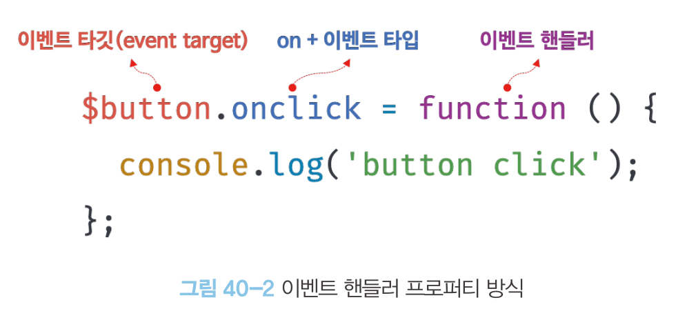
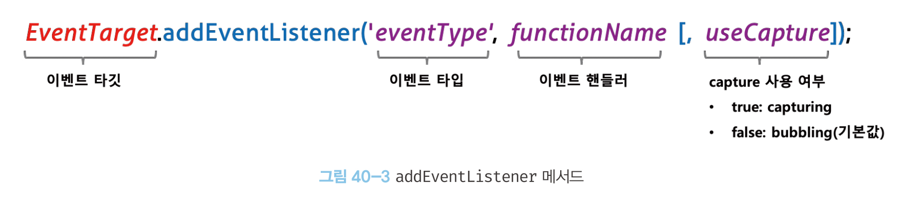
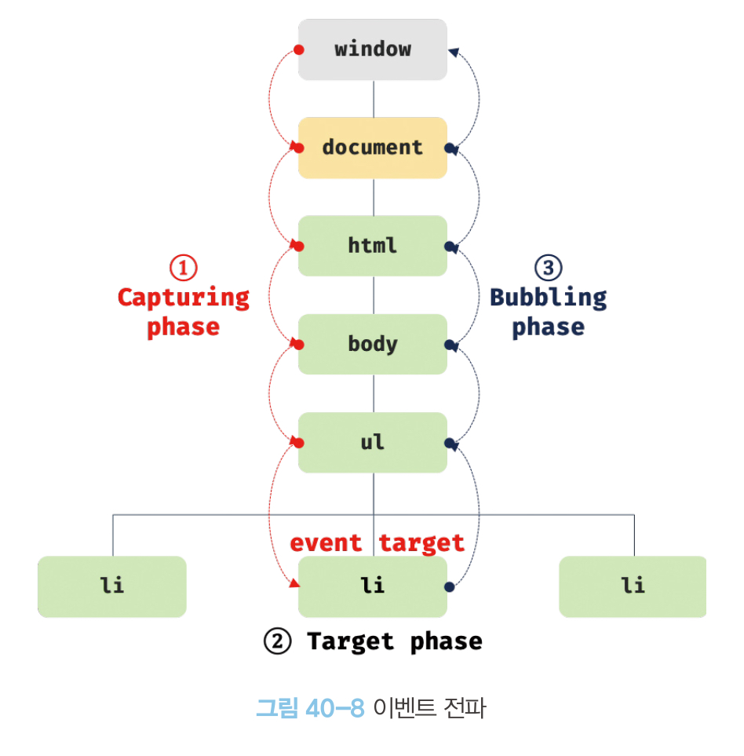

## 40장 이벤트
### 40.1 이벤트 드리븐 프로그래밍
- 브라우저는 처리해야 할 특정 사건이 발생하면 이를 감지하여 이벤트를 발생시킨다.
- 애플리케이션에서 특정 타입의 이벤트에 대해 반응하여 어떤 일을 하고 싶다면 해당하는 타입의 이벤트가 발생했을 때 호출될 함수를 브라우저에 알려 호출을 위임한다.
- 이벤트가 발생했을 때 호출될 함수를 이벤트 핸들러라고 하고, 이벤트가 발생했을 때 브라우저에게 이벤트 핸들러의 호출을 위임하는 것을 이벤트 핸들러 등록이라 한다.
- 프로그램의 흐름을 이벤트 중심으로 제어하는 프로그래밍 방식을 이벤트 드리븐 프로그래밍event-driven programming이라 한다.

### 40.2 이벤트 타입
- 이벤트 타입은 약 200여 가지가 있다.
- 이벤트 타입에 대한 상세 목록은 MDN의 Event reference에서 확인할 수 있다.

### 40.3 이벤트 핸들러 등록
#### 40.3.1 이벤트 핸들러 어트리뷰트 방식
- HTML 요소의 어트리뷰트 중 이벤트 핸들러 어트리뷰의 값으로 함수 참조가 아닌 **함수 호출문 등의 문**을 할당하여 이벤트 핸들러를 등록할 수 있다.
- 이벤트 핸들러 어트리뷰트의 이름은 onclick과 같이 on 접두사와 이벤트의 종류를 나타내는 이벤트 타입으로 이루어져 있다.
- 이벤트 핸들러 어트리뷰트 값은 암묵적으로 생성될 이벤트 핸들러의 함수 몸체를 의미한다.
```html
<!DOCTYPE html>
<html>
<body>
  <button onclick="sayHi('Lee')">Click me!</button>
  <script>
    function sayHi(name) {
      console.log(`Hi! ${name}.`);
    }
  </script>
</body>
</html>
```
위 예제에서 onClick은 파싱되어 다음과 같은 함수를 암묵적으로 생성하고, 이벤트 핸들러 어트리뷰트 이름과 동일한 키 onclick 이벤트 핸들러 프로퍼티에 할당한다.
```js
function onclick(event) {
  sayHi('Lee');
}
```
- 이처럼 동작하는 이유는 이벤트 핸들러에 인수를 전달하기 위해서이다.
- 이벤트 핸들러 어트리뷰트 값으로 여러 개의 문을 할당할 수 있다.
```html
<button onclick="console.log('Hi! '); console.log('Lee');">Click me!</button>
```
- 일반적으로 이러한 방식은 HTML과 자바스크립트가 혼재되어 권장하지 않지만, CBD(Component-Based Development) 방식의 Angular, React, Vue.js 에서는 HTML, CSS, JS를 모두 뷰를 구성하기 위한 구성 요소로 보고 이벤트 핸들러 어트리뷰트 방식으로 이벤트를 처리한다.
```html
<!-- Angular -->
<button (click)="handleClick($event)">Save</button>

{ /* React */ }
<button onClick={handleClick}>Save</button>

<!-- Svelte -->
<button on:click={handleClick}>Save</button>

<!-- Vue.js -->
<button v-on:click="handleClick($event)">Save</button>
```
#### 40.3.2 이벤트 핸들러 프로퍼티 방식
- window 객체와 Document, HTMLElement 타입의  DOM 노드 객체는 이벤트 핸들러 프로퍼티를 가지고 있다.
- onclick과 같이 on접두사와 이벤트의 종류를 나타내는 이벤트 타입으로 이루어져 있다.
- 이벤트 핸들러 프로퍼티에 함수를 바인딩하면 이벤트 핸들러가 등록된다.
- 이벤트 핸들러를 등록하기 위해서는 이벤트를 발생시킬 객체인 이벤트 타깃, 이벤트의 종류를 나타내는 문자열인 이벤트 타입, 이벤트 핸들러를 지정할 필요가 있다.

- 이벤트는 이벤트 타깃 또는 전파된 이벤트를 캐치할 DOM 노드 객체에 바인딩한다.
- 이벤트 핸들러 프로퍼티에는 하나의 이벤트 핸들러만 바인딩할 수 있다.
```html
<!DOCTYPE html>
<html>
<body>
  <button>Click me!</button>
  <script>
    const $button = document.querySelector('button');

    // 이벤트 핸들러 프로퍼티 방식은 하나의 이벤트에 하나의 이벤트 핸들러만을 바인딩할 수 있다.
    // 첫 번째로 바인딩된 이벤트 핸들러는 두 번째 바인딩된 이벤트 핸들러에 의해 재할당되어
    // 실행되지 않는다.
    $button.onclick = function () {
      console.log('Button clicked 1');
    };

    // 두 번째로 바인딩된 이벤트 핸들러
    $button.onclick = function () {
      console.log('Button clicked 2');
    };
  </script>
</body>
</html>
```
#### 40.3.3 addEventListenner 메서드 방식
- DOM Level2에서 도입된 이벤트 핸들러 등록 방식이다.

- 첫 번째 매개변수에는 이벤트 타입을, 두 번째 매개변수에는 이벤트 핸들러를, 마지막 매개변수에는 이벤트를 캐치할 이벤트 전파 단계를 지정한다.
- addEventListenner 메서드 방식은 이벤트 핸들러 프로퍼티에 바인딩된 이벤트 핸들러에 아무런 영향을 주지 않는다.
- addEventListenner 메서드는 하나 이상의 이벤트를 등록할 수 있고 이때 이벤트 핸들러는 등록된 순서대로 호출된다.
```html
<!DOCTYPE html>
<html>
<body>
  <button>Click me!</button>
  <script>
    const $button = document.querySelector('button');

    // addEventListener 메서드는 동일한 요소에서 발생한 동일한 이벤트에 대해
    // 하나 이상의 이벤트 핸들러를 등록할 수 있다.
    $button.addEventListener('click', function () {
      console.log('[1]button click');
    });

    $button.addEventListener('click', function () {
      console.log('[2]button click');
    });
  </script>
</body>
</html>
```
### 40.4 이벤트 핸들러 제거
- addEventListenner 메서드로 등록한 이벤트 핸들러는 removeEventListenner 메서드로 제거할 수 있다.
- 이벤트 핸들러를 제거하려면 이벤트 핸들러의 참조나 변수를 자료구조에 저장하고 있어야 한다.
```html
<!DOCTYPE html>
<html>
<body>
  <button>Click me!</button>
  <script>
    const $button = document.querySelector('button');

    const handleClick = () => console.log('button click');

    // 이벤트 핸들러 등록
    $button.addEventListener('click', handleClick);

    // 이벤트 핸들러 제거
    // addEventListener 메서드에 전달한 인수와 removeEventListener 메서드에
    // 전달한 인수가 일치하지 않으면 이벤트 핸들러가 제거되지 않는다.
    $button.removeEventListener('click', handleClick, true); // 실패
    $button.removeEventListener('click', handleClick); // 성공
  </script>
</body>
</html>
```
- 기명 이벤트 핸들러 내부에서 removeEventListener 메서드를 호출하면 이벤트 핸들러를 제거할 수 있고, 이때 이벤트 핸들러는 단 한번만 호출된다.
```html
// 기명 함수를 이벤트 핸들러로 등록
$button.addEventListener('click', function foo() {
  console.log('button click');
  // 이벤트 핸들러를 제거한다. 따라서 이벤트 핸들러는 단 한 번만 호출된다.
  $button.removeEventListener('click', foo);
});
```
- 기명 함수를 이벤트 핸들러로 등록할 수 없다면, 호출된 함수 자신을 가리키는 arguments.callee를 사용하여 이벤트 핸들러를 제거할 수 있다. 단, arguments.callee는 코드 최적화를 방해하기 때문에 strict mode에서 사용이 금지된다.
```html
// 무명 함수를 이벤트 핸들러로 등록
$button.addEventListener('click', function () {
  console.log('button click');
  // 이벤트 핸들러를 제거한다. 따라서 이벤트 핸들러는 단 한 번만 호출된다.
  // arguments.callee는 호출된 함수, 즉 함수 자신을 가리킨다.
  $button.removeEventListener('click', arguments.callee);
});
```
- 이벤트 핸들러 프로퍼티 방식으로 등록한 이벤트 핸들러는 removeEventListener 메서드로 제거할 수 없다.
- 이벤트 핸들러 프로퍼티 방식으로 등록한 이벤트 핸들러는 이벤트 핸들러 프로퍼티를 null로 할당하여 제거할 수 있다.
```html
$button.onclick = null;
```

### 40.5 이벤트 객체
- 이벤트가 발생하면 이벤트에 관련된 다양한 정보를 담고 있는 이벤트 객체가 동적으로 생성된다.
- 생성된 이벤트 객체는 이벤트 핸들러의 첫 번째 인수로 전달된다. 브라우저가 이벤트 핸들러를 호출할 때 이벤트 객체를 인수로 전달하기 때문이다.
```html
<!DOCTYPE html>
<html>
<body>
  <p>클릭하세요. 클릭한 곳의 좌표가 표시됩니다.</p>
  <em class="message"></em>
  <script>
    const $msg = document.querySelector('.message');

    // 클릭 이벤트에 의해 생성된 이벤트 객체는 이벤트 핸들러의 첫 번째 인수로 전달된다.
    function showCoords(e) {
      $msg.textContent = `clientX: ${e.clientX}, clientY: ${e.clientY}`;
    }

    document.onclick = showCoords;
  </script>
</body>
</html>
```
- 이벤트 핸들러 어트리뷰트 방식으로 이벤트 핸들러를 등록했다면 event를 통해 이벤트 객체를 전달받을 수 있다.
- 암묵적으로 생성된 onclick 이벤트 핸들러의 첫 번째 매개변수의 이름이 event로 암묵적으로 명명되기 때문에 event가 아닌 다른 이름으로는 이벤트 객체를 전달받지 못한다.
```html
<!DOCTYPE html>
<html>
<head>
  <style>
    html, body { height: 100%; }
  </style>
</head>
<!-- 이벤트 핸들러 어트리뷰트 방식의 경우 event가 아닌 다른 이름으로는 이벤트 객체를
전달받지 못한다. -->
<body onclick="showCoords(event)">
  <p>클릭하세요. 클릭한 곳의 좌표가 표시됩니다.</p>
  <em class="message"></em>
</body>
</html>

function onclick(event) {
  showCoords(event);
}
```

#### 40.5.1 이벤트 객체의 상속 구조
- 이벤트가 발생하면 암묵적으로 생성되는 이벤트 객체는 생성자 함수에 의해 생성된다. 그리고 생성된 이벤트 객체는 생성자 함수와 더불어 생성되는 프로토타입으로 구성된 프로토타입 체인의 일원이 된다.
- CustomEvent 타입의 이벤트 객체는 자바스크립트 코드에 의해 인위적으로 생성한 이벤트 객체다.
#### 40.5.2 이벤트 객체의 공통 프로퍼티
- Event.prototype에 정의되어 있는 이벤트 관련 프로퍼티는 UIEvent, CustomEvent, MouseEvent 등 모든 파생 이벤트 객체에 상속된다.
- target은 이벤트를 발생시킨 DOM 요소를, currentTarget은 이벤트 핸들러가 바인딩된 DOM 요소를 가리킨다.

### 40.6 이벤트 전파
- DOM 트리 상에 존재하는 DOM 요소 노드에서 발생한 이벤트는 DOM 트리를 통해 전파된다. 이를 이벤트 전파event propagation라고 한다.
- 이벤트 전파는 이벤트 객체가 전파되는 방향에 따라 3단계로 구분할 수 있다.

  - 캡처링 단계(capturing phase): 이벤트가 상위 요소에서 하위 요소 방향으로 전파
  - 타깃 단계(target phase): 이벤트가 이벤트 타깃에 도달
  - 버블링 단계(bubbling phase): 이벤트가 하위 요소에서 상위 요소 방향으로 전파
- 이벤트 핸들러 어트리뷰트/프로퍼티 방식으로 등록한 이벤트 핸들러는 타깃 단계와 버블링 단계의 이벤트만 캐치할 수 있다.
- addEventListenner 메서드 방식으로 등록한 이벤트 핸들러는 타깃 단계와 버블링 단계뿐만 아니라 캡처링 단계의 이벤트로 선별적으로 캐치할 수 있다.
```html
<!DOCTYPE html>
<html>
<body>
  <ul id="fruits">
    <li id="apple">Apple</li>
    <li id="banana">Banana</li>
    <li id="orange">Orange</li>
  </ul>
  <script>
    const $fruits = document.getElementById('fruits');
    const $banana = document.getElementById('banana');

    // #fruits 요소의 하위 요소인 li 요소를 클릭한 경우
    // 캡처링 단계의 이벤트를 캐치한다.
    $fruits.addEventListener('click', e => {
      console.log(`이벤트 단계: ${e.eventPhase}`); // 1: 캡처링 단계
      console.log(`이벤트 타깃: ${e.target}`); // [object HTMLLIElement]
      console.log(`커런트 타깃: ${e.currentTarget}`); // [object HTMLUListElement]
    }, true);

    // 타깃 단계의 이벤트를 캐치한다.
    $banana.addEventListener('click', e => {
      console.log(`이벤트 단계: ${e.eventPhase}`); // 2: 타깃 단계
      console.log(`이벤트 타깃: ${e.target}`); // [object HTMLLIElement]
      console.log(`커런트 타깃: ${e.currentTarget}`); // [object HTMLLIElement]
    });

    // 버블링 단계의 이벤트를 캐치한다.
    $fruits.addEventListener('click', e => {
      console.log(`이벤트 단계: ${e.eventPhase}`); // 3: 버블링 단계
      console.log(`이벤트 타깃: ${e.target}`); // [object HTMLLIElement]
      console.log(`커런트 타깃: ${e.currentTarget}`); // [object HTMLUListElement]
    });
  </script>
</body>
</html>
```
- 대부분의 이벤트는 캡처링과 버블링을 통해 전파되지만, 버블링을 통해 이벤트가 전파되지 않는 이벤트도 있다.
  - 포커스 이벤트(focus, blur), 리소스 이벤트(load, unload, abort, error), 마우스 이벤트(mouseenter, mouseleave)
  - 대체할 수 있는 다른 이벤트를 통해 버블링 단계에서 이벤트를 캐치할 수 있다.

  ### 40.7 이벤트 위임
  - 이벤트 위임event delegation은 여러 하위 DOM 요소에 각각 이벤트 핸들러를 등록하는 대신 하나의 상위 DOM 요소에 이벤트 핸들러를 등록하는 방법이다.
```html
<!DOCTYPE html>
<html>
<head>
  <style>
    #fruits {
      display: flex;
      list-style-type: none;
      padding: 0;
    }

    #fruits li {
      width: 100px;
      cursor: pointer;
    }

    #fruits .active {
      color: red;
      text-decoration: underline;
    }
  </style>
</head>
<body>
  <nav>
    <ul id="fruits">
      <li id="apple" class="active">Apple</li>
      <li id="banana">Banana</li>
      <li id="orange">Orange</li>
    </ul>
  </nav>
  <div>선택된 내비게이션 아이템: <em class="msg">apple</em></div>
  <script>
    const $fruits = document.getElementById('fruits');
    const $msg = document.querySelector('.msg');

    // 사용자 클릭에 의해 선택된 내비게이션 아이템(li 요소)에 active 클래스를 추가하고
    // 그 외의 모든 내비게이션 아이템의 active 클래스를 제거한다.
    function activate({ target }) {
      // 이벤트를 발생시킨 요소(target)가 ul#fruits의 자식 요소가 아니라면 무시한다.
      if (!target.matches('#fruits > li')) return;

      [...$fruits.children].forEach($fruit => {
        $fruit.classList.toggle('active', $fruit === target);
        $msg.textContent = target.id;
      });
    }

    // 이벤트 위임: 상위 요소(ul#fruits)는 하위 요소의 이벤트를 캐치할 수 있다.
    $fruits.onclick = activate;
  </script>
</body>
</html>
```
- 이벤트 위임을 통해 이벤트를 처리할 때는 이벤트를 실제로 발생시킨 DOM 요소가 기대한 DOM 요소가 아닐 수 있기 때문에 반응이 필요한 DOM 요소에 한정하여 이벤트 핸들러가 실행되도록 이벤트 타깃을 검사할 필요가 있다.
- Element.prototype.matches 메서드를 통해 특정 노드를 탐색 가능한지 확인할 수 있다.
- 일반적으로 이벤트 객체의 target 프로퍼티와 currentTarget 프로퍼티는 동일한 DOM 요소를 가리키지만 이벤트 위임을 통해 상위 DOM 요소에 이벤트를 바인딩한 경우 이벤트 객체의 target 프로퍼티와 currentTarget 프로퍼티가 다른 DOM 요소를 가리킬 수 있다.

### 40.8 DOM 요소의 기본 동작 조작
#### 40.8.1 DOM 요소의 기본 동작 중단
- 이벤트 객체의 preventDefault 메서드는 DOM 요소의 기본 동작을 중단시킨다.
#### 40.8.2 이벤트 전파 방지
- 이벤트 객체의 stopPropagation 메서드는 이벤트 전파를 중단시킨다.
- 이벤트를 위임한 경우 하위 DOM 요소에서 stopPropagation 메서드를 호출하면 상위 DOM 요소의 이벤트 핸들러가 호출되지 않아 자신에게 바인딩된 이벤트 핸들러만 실행된다.

### 40.9 이벤트 핸들러 내부의 this
#### 40.9.1 이벤트 핸들러 어트리뷰트 방식
- 이벤트 핸들러 어트리뷰트의 값으로 지정된 문자열은 암묵적으로 생성되는 이벤트 핸들러의 문으로, 일반 함수로 호출되기 때문에 전역 객체 window를 가리킨다.
- 단, 이벤트 핸들러를 호출할 때 인수로 전달한 this는 이벤트를 바인딩한 DOM 요소를 가리킨다.
```html
<!DOCTYPE html>
<html>
<body>
  <button onclick="handleClick(this)">Click me</button>
  <script>
    function handleClick(button) {
      console.log(button); // 이벤트를 바인딩한 button 요소
      console.log(this);   // window
    }
  </script>
</body>
</html>
```
#### 40.9.2 이벤트 핸들러 프로퍼티 방식과 addEventListenner 메서드 방식
- 이벤트 핸들러 프로퍼티 방식과 addEventListenner 메서드 방식으로 이벤트 핸들러를 바인딩한 경우 이벤트 핸들러 내부의 this는 이벤트를 바인딩한 DOM 요소를 가리킨다. 즉, 이벤트 객체의 currentTarget 프로퍼티와 같다.
- 화살표 함수로 정의한 이벤트 핸들러 내부의 this는 상위 스코프의 this를 가리킨다.
```html
<!DOCTYPE html>
<html>
<body>
  <button class="btn1">0</button>
  <button class="btn2">0</button>
  <script>
    const $button1 = document.querySelector('.btn1');
    const $button2 = document.querySelector('.btn2');

    // 이벤트 핸들러 프로퍼티 방식
    $button1.onclick = e => {
      // 화살표 함수 내부의 this는 상위 스코프의 this를 가리킨다.
      console.log(this); // window
      console.log(e.currentTarget); // $button1
      console.log(this === e.currentTarget); // false

      // this는 window를 가리키므로 window.textContent에 NaN(undefined + 1)을 할당한다.
      ++this.textContent;
    };

    // addEventListener 메서드 방식
    $button2.addEventListener('click', e => {
      // 화살표 함수 내부의 this는 상위 스코프의 this를 가리킨다.
      console.log(this); // window
      console.log(e.currentTarget); // $button2
      console.log(this === e.currentTarget); // false

      // this는 window를 가리키므로 window.textContent에 NaN(undefined + 1)을 할당한다.
      ++this.textContent;
    });
  </script>
</body>
</html>
```
- 클래스에서 이벤트 핸들러를 바인딩하는 경우 this에 주의해야 한다.

### 40.10 이벤트 핸들러에 인수 전달
- 이벤트 핸들러 어트리뷰트 방식은 함수 호출문을 사용할 수 있기 때문에 인수를 전달할 수 있지만, 이벤트 핸들러 프로퍼티 방식과 addEventListenner 메서드 방식은 함수 호출이 아니라 함수 자체를 등록하기 때문에 인수를 전달할 수 있다.
- 이벤트 핸들러 내부에서 함수를 호출하면서 인수를 전달할 수 있다.
```html
<!DOCTYPE html>
<html>
<body>
  <label>User name <input type='text'></label>
  <em class="message"></em>
  <script>
    const MIN_USER_NAME_LENGTH = 5; // 이름 최소 길이
    const $input = document.querySelector('input[type=text]');
    const $msg = document.querySelector('.message');

    const checkUserNameLength = min => {
      $msg.textContent
        = $input.value.length < min ? `이름은 ${min}자 이상 입력해 주세요` : '';
    };

    // 이벤트 핸들러 내부에서 함수를 호출하면서 인수를 전달한다.
    $input.onblur = () => {
      checkUserNameLength(MIN_USER_NAME_LENGTH);
    };
  </script>
</body>
</html>
```
- 이벤트 핸들러를 반환하는 함수를 호출하면서 인수를 전달할 수도 있다.
```html
<!DOCTYPE html>
<html>
<body>
  <label>User name <input type='text'></label>
  <em class="message"></em>
  <script>
    const MIN_USER_NAME_LENGTH = 5; // 이름 최소 길이
    const $input = document.querySelector('input[type=text]');
    const $msg = document.querySelector('.message');

    // 이벤트 핸들러를 반환하는 함수
    const checkUserNameLength = min => e => {
      $msg.textContent
        = $input.value.length < min ? `이름은 ${min}자 이상 입력해 주세요` : '';
    };

    // 이벤트 핸들러를 반환하는 함수를 호출하면서 인수를 전달한다.
    $input.onblur = checkUserNameLength(MIN_USER_NAME_LENGTH);
  </script>
</body>
</html>
```

### 40.11 커스텀 이벤트
#### 40.11.1 커스텀 이벤트 생성
- 이벤트 생성자 함수를 사용하여 개발자의 의도로 생성된 이벤트를 커스텀 이벤트라 한다.
- 이벤트 타입을 나타내는 문자열은 기존 이벤트 타입을 사용할 수도 있고, 기존 이벤트 타입이 아닌 임의의 문자열을 사용하여 새로운 이벤트 타입을 지정할 수 있다.
``html
// KeyboardEvent 생성자 함수로 keyup 이벤트 타입의 커스텀 이벤트 객체를 생성
const keyboardEvent = new KeyboardEvent('keyup');
console.log(keyboardEvent.type); // keyup

// CustomEvent 생성자 함수로 foo 이벤트 타입의 커스텀 이벤트 객체를 생성
const customEvent = new CustomEvent('foo');
console.log(customEvent.type); // foo

// MouseEvent 생성자 함수로 click 이벤트 타입의 커스텀 이벤트 객체를 생성
const customEvent = new MouseEvent('click');
console.log(customEvent.type); // click
console.log(customEvent.bubbles); // false
console.log(customEvent.cancelable); // false
```
- 생성된 커스텀 이벤트 객체는 버블링되지 않으며 preventDefault 메서드를 사용하여 취소할 수 없다.
- 커스텀 이벤트 객체의 bubbles 또는 cancelable 프로퍼티를 true로 설정하려면 이벤트 생성자 함수의 두 번째 인수로 bubbles 또는 cancelable 프로퍼티를 갖는 객체를 전달한다.
```html
// MouseEvent 생성자 함수로 click 이벤트 타입의 커스텀 이벤트 객체를 생성
const customEvent = new MouseEvent('click', {
  bubbles: true,
  cancelable: true
});

console.log(customEvent.bubbles); // true
console.log(customEvent.cancelable); // true
```
- 커스텀 이벤트 객체에는 이벤트 타입에 따라 가지는 이벤트 고유의 프로퍼티 값을 지정할 수 있다.
```html
// MouseEvent 생성자 함수로 click 이벤트 타입의 커스텀 이벤트 객체를 생성
const mouseEvent = new MouseEvent('click', {
  bubbles: true,
  cancelable: true,
  clientX: 50,
  clientY: 100
});

console.log(mouseEvent.clientX); // 50
console.log(mouseEvent.clientY); // 100

// KeyboardEvent 생성자 함수로 keyup 이벤트 타입의 커스텀 이벤트 객체를 생성
const keyboardEvent = new KeyboardEvent('keyup', { key: 'Enter' });

console.log(keyboardEvent.key); // Enter
```
- 이벤트 생성자 함수로 생성한 커스텀 이벤트는 isTrusted 프로퍼티 값이 false이다. 커스텀 이벤트가 아닌 사용자의 행위에 의해 발생한 이벤트에 의해 생성된 이벤트 객체의 isTrusted 프로퍼티 값은 true이다.
```html
// InputEvent 생성자 함수로 foo 이벤트 타입의 커스텀 이벤트 객체를 생성
const customEvent = new InputEvent('foo');
console.log(customEvent.isTrusted); // false
```
#### 커스텀 이벤트 디스패치
- 생성된 커스텀 이벤트는 dispatchEvent 메서드를 사용하여 디스패치할 수 있다.
- 일반적으로 이벤트 핸들러는 비동기 처리 방식으로 동작하지만 dispatchEvent 메서드는 이벤트 핸들러를 동기 처리 방식으로 호출한다. 따라서 dispatchEvent 메서드로 이벤트를 디스패치 하기 이전에 커스텀 이벤트를 처리할 이벤트 핸들러를 등록해야 한다.
```html
<!DOCTYPE html>
<html>
<body>
  <button class="btn">Click me</button>
  <script>
    const $button = document.querySelector('.btn');

    // 버튼 요소에 click 커스텀 이벤트 핸들러를 등록
    // 커스텀 이벤트를 디스패치하기 이전에 이벤트 핸들러를 등록해야 한다.
    $button.addEventListener('click', e => {
      console.log(e); // MouseEvent {isTrusted: false, screenX: 0, ...}
      alert(`${e} Clicked!`);
    });

    // 커스텀 이벤트 생성
    const customEvent = new MouseEvent('click');

    // 커스텀 이벤트 디스패치(동기 처리). click 이벤트가 발생한다.
    $button.dispatchEvent(customEvent);
  </script>
</body>
</html>
```
- CustomEvent 이벤트 생성자 함수에는 두 번째 인수로 이벤트와 함께 전달하고 싶은 정보를 담은 detail 프로퍼티를 포함하는 객체를 전달할 수 있다.
```html
<!DOCTYPE html>
<html>
<body>
  <button class="btn">Click me</button>
  <script>
    const $button = document.querySelector('.btn');

    // 버튼 요소에 foo 커스텀 이벤트 핸들러를 등록
    // 커스텀 이벤트를 디스패치하기 이전에 이벤트 핸들러를 등록해야 한다.
    $button.addEventListener('foo', e => {
      // e.detail에는 CustomEvent 함수의 두 번째 인수로 전달한 정보가 담겨 있다.
      alert(e.detail.message);
    });

    // CustomEvent 생성자 함수로 foo 이벤트 타입의 커스텀 이벤트 객체를 생성
    const customEvent = new CustomEvent('foo', {
      detail: { message: 'Hello' } // 이벤트와 함께 전달하고 싶은 정보
    });

    // 커스텀 이벤트 디스패치
    $button.dispatchEvent(customEvent);
  </script>
</body>
</html>
```
- 커스텀 이벤트 객체를 생성한 경우 반드시 addEventListener 메서드를 사용하여 이벤트 핸들러를 등록해야 한다. 'on + 이벤트 타입'으로 이루어진 이벤트 핸들러 어트리뷰트/프로퍼티가 요소 노드에 존재하지 않기 때문에 이벤트 핸들러 어트리뷰트/프로퍼티 방식으로는 이벤트 핸들러를 등록할 수 없다.


