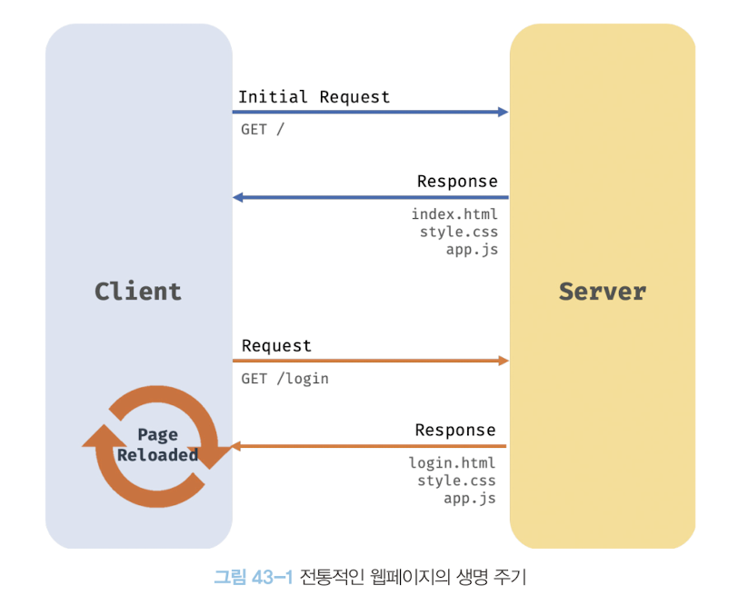

## 43장 Ajax
### 43.1 Ajax란?
- Ajax(Asynchronous JavaScript and XML)란 자바스크립트를 사용하여 브라우저가 서버에게 비동기 방식으로 데이터를 요청하고, 데이터를 수신하여 웹페이지를 동적으로 갱신하는 프로그래밍 방식을 말한다.
- Ajax는 브라우저에서 제공하는 Web API인 XMLHttpRequest 객체를 기반으로 동작한다. XMLHttpRequest 객체는 서버와 브라우저 사이에서 데이터를 주고받기 위한 메서드와 프로퍼티를 제공한다.
- XMLHttpRequest는 HTTP 비동기 통신을 위한 메서드와 프로퍼티를 제공한다.
- Ajax 이전에는 완전한 HTML을 서버로부터 전송받아 웹페이지를 처음부터 다시 렌더링하는 방식으로 동작했다. 이 방식은 변경할 필요가 없는 부분까지 포함한 완전한 HTML을 서버로부터 전송받기 때문에 불필요한 데이터 통신이 발생하고, 처음부터 다시 렌더링하기 때문에 화면 전환이 일어나서 화면이 순간적으로 깜빡이는 현상이 발생한다. 또, 클라이언트와 서버와의 통신이 동기 방식으로 진행되어 서버로부터 응답이 있을 때까지 다음 처리는 블로킹된다.

- Ajax의 등장으로 서버로부터 웹페이지 변경에 필요한 데이터만 비동기 방식으로 전송받아 변경이 필요한 부분만 한정적으로 렌더링하는 방식이 가능해졌다. 필요한 데이터만 전송받기 때문에 불필요한 데이터 통신이 발생하지 않고, 필요할 필요가 없는 부분은 다시 렌더링하지 않아 화면이 깜빡이는 현상이 발생하지 않는다. 또, 서버와의 통신이 비동기 방식으로 동작하기 때문에 서버에게 요청을 보낸 이후 블로킹이 발생하지 않는다.


### 43.2 JSON
- JSON(JavaScript Object Notation)은 클라이언트와 서버 간의 HTTP 통신을 위한 텍스트 데이터 포맷이다.
- 자바스크립트에 종속되지 않는 언어 독립형 데이터 포맷으로, 대부분의 프로그래밍 언어에서 사용할 수 있다.
- JSON은 자바스크립트 객체 리터럴과 유사하게 키와 값으로 구성된 순수한 텍스트이다. 키는 반드시 큰 따옴표로 묶어야 한다.
- JSON.stringify 메서드는 객체를 JSON 포맷의 문자열로 변환한다. 클라이언트가 서버로 객체를 전송하려면 객체를 문자열화해야 하는데 이를 직렬화serializing라고 한다. 배열도 JSON.stringify 메서드를 사용해 문자열로 변환할 수 있다.
- JSON.parse 메서드는 JSON 포맷의 문자열을 객체로 변환한다. 서버로부터 데이터를 전송받은 문자열 데이터를 객체로 사용하려면 JSON 포맷의 문자열을 객체화해야 하는데 이를 역직렬화deserializing라고 한다. 배열이 JSON 포맷의 문자열로 변환되어 있는 경우에는 배열 객체로 변환한다.

### 43.3 XMLHttpRequest 객체
- 브라우저는 주소창이나 HTML의 form 태그, a 태그를 통해 HTTP 요청 전송 기능을 기본 제공한다.
- 자바스크립트를 사용하여 HTTP 요청을 전송하려면 XMLHttpRequest 객체를 사용한다.
- XMLHttpRequest 객체는 Web API로 브라우저 환경에서만 정상적으로 동작하고, HTTP 요청 전송 기능과 서버로부터 응답을 처리하는 메서드를 제공한다.
- XMLHttpRequest 객체는 XMLHttpRequest 생성자 함수를 호출하여 생성한다.
```js
// XMLHttpRequest 객체 생성
const xhr = new XMLHttpRequest();

// HTTP 요청 초기화
xhr.open('GET', '/users');

// HTTP 요청 헤더 설정
// 클라이언트가 서버로 전송할 데이터의 MIME 타입 지정: json
xhr.setRequestHeader('content-type', 'application/json');

// HTTP 요청 전송
xhr.send();
```
- GET 요청 메서드는 데이터를 URL의 일부분인 query string으로 서버에 전송한다. POST 요청 메서드는 데이터(페이로드)를 request body에 담아 전송한다. 페이로드가 객체인 경우 반드시 JSON.stringify 메서드를 사용해 직렬화한 다음 전달해야 한다.
- HTTP 요청 헤더인 Content-type에는 request body에 담아 전송할 데이터의 MINE 타입의 정보를 주로 표현한다. 서버가 응답한 데이터의 MINE 타입은 accept로 지정할 수 있다.
```js
// XMLHttpRequest 객체 생성
const xhr = new XMLHttpRequest();

// HTTP 요청 초기화
xhr.open('POST', '/users');

// HTTP 요청 헤더 설정
// 클라이언트가 서버로 전송할 데이터의 MIME 타입 지정: json
xhr.setRequestHeader('content-type', 'application/json');

// HTTP 요청 전송
xhr.send(JSON.stringify({ id: 1, content: 'HTML', completed: false }));

// 서버가 응답할 데이터의 MIME 타입 지정: json
xhr.setRequestHeader('accept', 'application/json');
```
- XMLHttpRequest 객체는 onreadystatechange, onload, onerror 이벤트 핸들러를 사용해 서버의 응답을 처리한다.
```js
// XMLHttpRequest 객체 생성
const xhr = new XMLHttpRequest();

// HTTP 요청 초기화
// https://jsonplaceholder.typicode.com은 Fake REST API를 제공하는 서비스다.
xhr.open('GET', 'https://jsonplaceholder.typicode.com/todos/1');

// HTTP 요청 전송
xhr.send();

// readystatechange 이벤트는 HTTP 요청의 현재 상태를 나타내는 readyState 프로퍼티가
// 변경될 때마다 발생한다.
xhr.onreadystatechange = () => {
  // readyState 프로퍼티는 HTTP 요청의 현재 상태를 나타낸다.
  // readyState 프로퍼티 값이 4(XMLHttpRequest.DONE)가 아니면 서버 응답이 완료되지 상태다.
  // 만약 서버 응답이 아직 완료되지 않았다면 아무런 처리를 하지 않는다.
  if (xhr.readyState !== XMLHttpRequest.DONE) return;

  // status 프로퍼티는 응답 상태 코드를 나타낸다.
  // status 프로퍼티 값이 200이면 정상적으로 응답된 상태이고
  // status 프로퍼티 값이 200이 아니면 에러가 발생한 상태다.
  // 정상적으로 응답된 상태라면 response 프로퍼티에 서버의 응답 결과가 담겨 있다.
  if (xhr.status === 200) {
    console.log(JSON.parse(xhr.response));
    // {userId: 1, id: 1, title: "delectus aut autem", completed: false}
  } else {
    console.error('Error', xhr.status, xhr.statusText);
  }
};
```
```js
// XMLHttpRequest 객체 생성
const xhr = new XMLHttpRequest();

// HTTP 요청 초기화
// https://jsonplaceholder.typicode.com은 Fake REST API를 제공하는 서비스다.
xhr.open('GET', 'https://jsonplaceholder.typicode.com/todos/1');

// HTTP 요청 전송
xhr.send();

// load 이벤트는 HTTP 요청이 성공적으로 완료된 경우 발생한다.
xhr.onload = () => {
  // status 프로퍼티는 응답 상태 코드를 나타낸다.
  // status 프로퍼티 값이 200이면 정상적으로 응답된 상태이고
  // status 프로퍼티 값이 200이 아니면 에러가 발생한 상태다.
  // 정상적으로 응답된 상태라면 response 프로퍼티에 서버의 응답 결과가 담겨 있다.
  if (xhr.status === 200) {
    console.log(JSON.parse(xhr.response));
    // {userId: 1, id: 1, title: "delectus aut autem", completed: false}
  } else {
    console.error('Error', xhr.status, xhr.statusText);
  }
};
```
